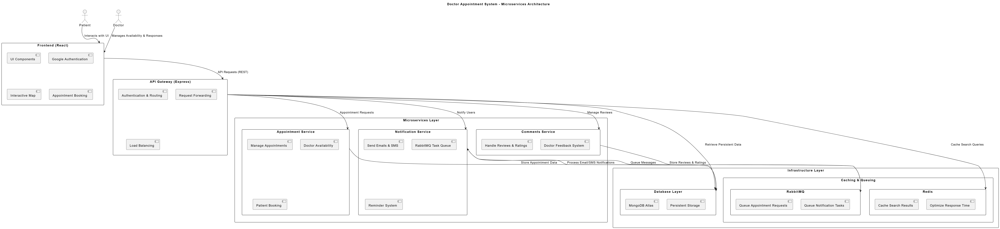

# Doctor Appointment System

# Presentation Link : https://youtu.be/UvEvrY8d_Dg

##  Project Overview
This project is a **full-featured doctor appointment system** that allows patients to book appointments with doctors. It utilizes **API Gateway**, **Microservices Architecture**, **Google Authentication**, **MongoDB Atlas**, **Azure Deployment**, **RabbitMQ**, and **Redis**.

---

##  Technologies Used

| Technology | Description |
|-----------|-------------|
| **Node.js** | Backend development |
| **Express.js** | API development |
| **React.js** | Frontend development |
| **MongoDB Atlas** | Database management |
| **RabbitMQ** | Message queue service |
| **Redis** | Caching system |
| **Docker & Docker Compose** | Containerizing services |

---

 Features

Doctors can be viewed on an interactive map, allowing patients to locate nearby doctors easily.

Email notifications are sent to patients upon booking an appointment and a comment received.

Google Authentication allows doctors to sign in securely.

Redis caching ensures faster search results, improving performance and efficiency.

Appointments and notifications are queued and processed via RabbitMQ, ensuring smooth and efficient message handling.

Search results are used to dynamically filter doctors on the interactive map, enhancing user experience.

##  Setup & Running Instructions

### **1️⃣ Install Dependencies**
After cloning the project, run the following command to install dependencies for all services:
```sh
npm install
```
**For each service separately:**
```sh
cd api-gateway && npm install
cd appointment-service && npm install
cd comments-service && npm install
cd notification-service && npm install
cd frontend && npm install
```

### **2️⃣ Start Services**
 **To start each service individually:**
```sh
cd api-gateway && node server.js
cd appointment-service && node server.js
cd comments-service && node server.js
cd notification-service && node server.js
cd frontend && npm start
```
 **To start all services using Docker Compose:**
```sh
docker-compose up --build
```

##  API Usage
**API requests should be made through the API Gateway:**
```sh
GET http://localhost:5000/api/doctors
POST http://localhost:5000/api/appointments
POST http://localhost:5000/api/comments
```
**Example API Call:**
```sh
curl -X POST http://localhost:5000/api/appointments \
-H "Content-Type: application/json" \
-d '{"doctorId": "123", "patientId": "456", "date": "2024-06-01", "time": "10:00"}'
```

---

##  Environment Variables (`.env` Configuration)

 **Each service should have the following `.env` variables set in the environment:**
```env
# API Gateway
PORT=5000
COMMENTS_SERVICE_URL=http://localhost:5001
APPOINTMENT_SERVICE_URL=http://localhost:5002
NOTIFICATION_SERVICE_URL=http://localhost:5003

# MongoDB Database
MONGO_URI= - 

# Google Authentication
GOOGLE_CLIENT_ID= - 
GOOGLE_CLIENT_SECRET= - 

# Redis and RabbitMQ
REDIS_URL=redis://localhost:6379
RABBITMQ_URL=amqp://localhost

# Frontend
REACT_APP_API_URL=http://localhost:5000/api
```

